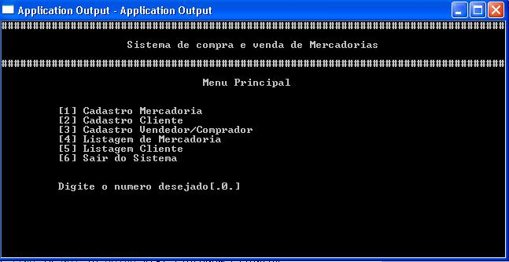

# Exemplo de BOT de menu com rasa

[](./LICENSE)


[](https://github.com/ellerbrock/open-source-badges/)

Este é um exemplo de chatbot que mostra uma maneira de criar um assistente baseado em menus de número usando o [Rasa](https://rasa.com/).

O objetivo é dar algumas idéias de design e o bot pode ser ainda mais otimizado.

Talvez este tipo de bot não seja a melhor forma de usar o RASA, lembra um pouco aqueles programas em COBOL dos anos 80, mas, vá lá, pode ter sua aplicação.



## Treine o bot e crie os contêineres necessários

Run:
```bash
mkdir -p core/models
chmod -R ugo+rwx core/models
docker-compose build
```

## Inicie os contêineres

Run:
```bash
docker-compose up -d
```

## Teste o bot

Abra `http://localhost:2015/` no seu browser, clique na imagem de bot no lado direito inferior da página e envie um oi para o bot.

## Alterando o bot

Se você quiser alterar alguma coisa no bot, seja no `actions/actions.py` ou em qualquer dos arquivos que estão em *core/data* você terá de treinar novamente o bot assim:

Run:
```bash
docker-compose down
dockker-compose build
docker-compose up -d
```

## Visão geral dos arquivos

`core/data/stories.yml` - contains [stories](https://rasa.com/docs/rasa/stories/)

`core/data/rules.yml` - contains [rules](https://rasa.com/docs/rasa/rules)

`core/data/nlu/` - contains [NLU training data](https://rasa.com/docs/rasa/nlu-training-data)

`actions/actions.py` - contains [custom action](https://rasa.com/docs/rasa/custom-actions)/api calls code

`core/domain.yml`         - the [domain](https://rasa.com/docs/rasa/domain) file, including bot response templates

`core/config.yml`         - training [configurations](https://rasa.com/docs/rasa/model-configuration) for the NLU pipeline and policy ensemble

## Coisas que você pode perguntar ao bot

O bot é baseado no [mood bot](https://github.com/RasaHQ/rasa/tree/main/examples/moodbot) ao qual foi adicionado um menu que aparece *quando você o cumprimenta*.

A partir daí, você pode usar os números de opção para navegar em uma estrutura de menus.

> O bot não oferece suporte a uma formulação em linguagem natural de nenhuma das opções. _Apenas a escolha por meio de números é suportada_.

Não se esqueça de deixar uma estrela se for útil para você 😁

# Agradecimentos

A versão original deste bot é de https://github.com/DerXter/NumMenu-Bot, apenas traduzi textos, mudei o exemplo original para um de uma clínica médica e usei o docker-compose para facilitar os testes de quem não tem um ambiente de desenvolvimento python instalado no seu computador.

## Contribuindo

Sinta-se à vontade para fazer um PR ou relatar um problema 😃

## Contribuidores

* Criador da versão oiriginal: [](https://twitter.com/derguene)
* [Abner Jacobsen](https://github.com/abnerjacobsen)


